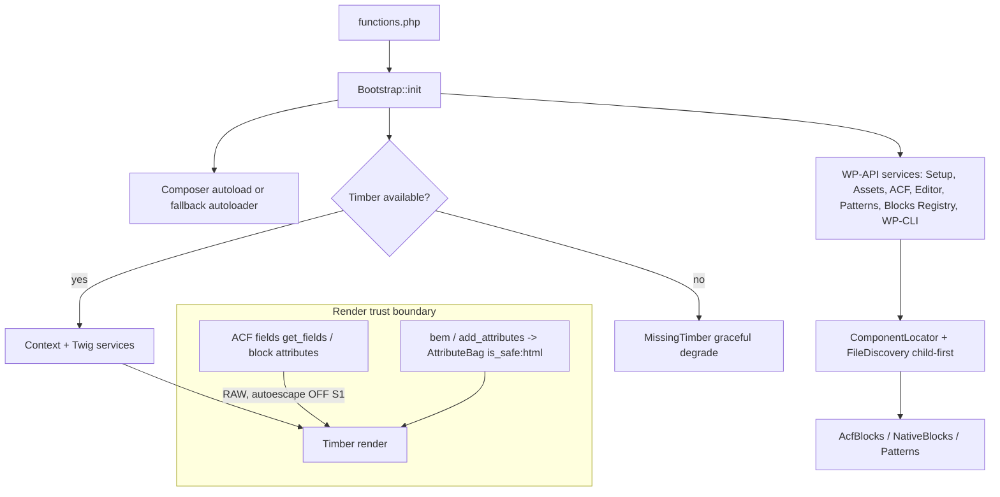

# Release Branch Evaluation — Emulsify WordPress 2.0 (PR #29)

> Independent, evidence-based release review. Analysis only — no code was modified, committed, or deployed.
> Reviewer roles applied: principal engineer, architect, security, performance, reliability, release manager.
> Date: 2026-07-23.

---

## 1. Executive Summary

- **Release branch:** `release-2.x` @ `d136804`
- **Baseline (merge base):** `53c3b44` (base branch `main`)
- **PR:** #29 "Release: Emulsify WordPress 2.0" — 55 commits, 360 files, **+28,859 / −6,251**
- **Scope reviewed:** entire runtime (`includes/`, ~9,200 LOC of new namespaced PHP), WP-CLI child-theme generator, Timber/Twig integration, block/pattern/editor services, asset pipeline, CI workflows, semantic-release config, docs (~18 files), and the Whisk child-theme starter.

**Release-readiness verdict: NOT READY (ready with conditions after a small set of fixes).**
**Confidence: Medium-High.** High confidence on findings I reproduced or read first-hand; Medium where PHP tooling could not run in the review sandbox (no PHP/Composer available — see §5).

**Why:** This is a genuinely strong, well-architected rewrite — clean separation of concerns, defensive coding, graceful degradation, and excellent documentation. But three things stand in the way of shipping: (1) the **automated release pipeline fails** at its own `npm audit` gate; (2) the theme establishes an **unsafe-by-default Twig rendering contract** (autoescape off + raw ACF/block data) that will lead child themes into stored XSS; and (3) the **`wp emulsify --force` guard has a hole** that permits recursive deletion of a legitimate child theme, with no rollback.

**Top strengths**
- Clean, testable OOP runtime with a resilient bootstrap (Composer autoload → fallback autoloader → graceful "MissingTimber" degradation).
- No request-input attack surface in the runtime (zero superglobals, no AJAX/REST/admin-post handlers, no options I/O, no SQL, no `eval`); output is consistently `esc_*`-escaped and capability-gated.
- Strong path-traversal defenses (machine-name slugify, `../`/null-byte/absolute-path rejection in multiple loaders), injection-safe custom `` tag, and correct child-over-parent discovery precedence.
- Documentation coverage is unusually complete and largely matches the code.

**Top risks**
- Release pipeline blocked by full `npm audit` (dev-only `fast-uri` advisory) — **reproduced (exit 1)**.
- Autoescape-off default + raw ACF fields/block attributes in Twig context — **stored-XSS enabler**.
- `--force` recursive delete of a valid theme when `generatedFrom` is absent — **data loss**, no rollback.
- Unsanitized theme name templated into generated `functions.php`/`style.css` — **code injection into generated artifact**.
- The only real end-to-end WordPress render test never runs on PRs; no automated tests cover the XSS/escaping paths.

**Findings by severity:** Blocker 1 · High 3 · Medium 7 · Low ~18 · Opportunities 8

**Most important actions before release**
1. Fix the `npm audit` release gate (update `@commitlint/cli`/lockfile or scope the audit step).
2. Enable Twig autoescape for theme render paths (or formally document + escape injected context).
3. Sanitize the CLI theme name written into generated PHP/CSS.
4. Make the `--force` `generatedFrom` guard mandatory and add copy rollback.

---

## 2. Review Scope and Method

- **Merge base used:** `git merge-base main release-2.x` → `53c3b44e90c89d1008b424d76fdd2504193f7f00`.
- **Commit range reviewed:** `53c3b44..d136804` (55 commits).
- **Major subsystems affected:** theme bootstrap/runtime (`includes/Runtime`, `includes/Support`), block & pattern registration (`includes/Blocks`), editor governance (`includes/Editor`), ACF integration (`includes/Acf`), Twig extensions (`includes/Twig`), WP-CLI generation (`includes/Cli`), Whisk starter (`whisk/`), CI/release (`.github/`), docs (`docs/`). Removed: legacy component library, Storybook 6, Webpack, Travis, old tooling (209 deletions).
- **Commands/tools run:** `git` (log/diff/merge-base/diff --check), `npm audit` (full + `--omit=dev`) with exit-code capture, `npm ls fast-uri`, `node --check` on all JS/CJS, `wc`/`find` inventories, first-hand reads of high-risk files. Deep subsystem reviews were fanned out to focused review agents; their top findings were then independently re-verified against the source before inclusion.
- **Checks that could NOT be run (sandbox had Node 22 but no PHP/Composer):** `composer validate`, `composer install`, `phpcs`, `phpstan`, all `*-smoke.php` PHP smoke tests, `npm run pr:check` / `release:check` (they shell out to `composer`), semantic-release dry run, and the real WordPress fixture render. These are marked **Unable to run** in §5 with exact commands to complete them.
- **Assumptions:** GitHub Actions runners provide the intended PHP 8.3 + Node 24 + WP-CLI/MySQL matrix (per workflow YAML). The lockfile in the branch is what CI audits.
- **Limitations:** No dynamic execution of PHP; correctness/security conclusions for PHP paths are from static reading (with code quoted). Severity reflects realistic exploitability, not worst-case.

---

## 3. Change Map

| Area | Main changes | Key files | Public behavior affected | Risk |
|------|--------------|-----------|--------------------------|------|
| Theme bootstrap/runtime | New OOP bootstrap, autoload fallback, Timber init, missing-Timber handling | `functions.php`, `includes/Bootstrap.php`, `includes/Runtime/*` | Whole theme load path | Med |
| Twig integration | `bem()`/`add_attributes()` helpers, namespaces, `` tag, project component loader | `includes/Runtime/Twig.php`, `includes/Twig/*`, `includes/Support/AttributeBag.php` | Template authoring + output escaping | **High** |
| Blocks & patterns | ACF/Twig blocks, native block.json discovery, core-block Twig renderer, pattern registry, component locator + caching | `includes/Blocks/*` | Editor blocks, frontend render | **High** |
| Editor governance | Allowed block types, block-support overrides, pattern governance, user-pattern permissions, policy | `includes/Editor/*` | Admin/editor behavior | Med |
| Assets | Manifest + scanner discovery, child-first enqueue, block-scoped assets, memoization | `includes/Runtime/Assets.php`, `includes/Support/Asset*` | Frontend asset loading | Med |
| WP-CLI generation | `wp emulsify` child-theme generator (`--dry-run/--force/--activate/--machine-name/--parent`) | `includes/Cli/GenerateChildThemeCommand.php` | Operator tooling; filesystem writes/deletes | **High** |
| Whisk starter | Agnostic child-theme source aligned to Core 4/Vite | `whisk/**` | Generated project baseline | Med |
| CI / release | Theme-readiness + release workflows, semantic-release guard, PR/release check scripts, PHP smokes | `.github/**`, `release.config.js`, `package.json` | Release automation | **High** |
| Docs | 18 new docs + refreshed README | `docs/**`, `README.md` | Consumer guidance | Low |
| Removals | Legacy components, Storybook 6, Webpack, Travis, old configs | 209 deleted files | 1.x consumers (breaking) | Med |

- **Dependency changes:** Runtime PHP: `php >=8.3`, `timber/timber ^2.3` only. Dev: WPCS/PHPCS/PHPStan/stubs + semantic-release/commitlint/husky/lint-staged. **No runtime npm dependencies** (theme ships PHP/Timber). `npm audit --omit=dev` = 0 vulns.
- **API/contract changes:** Major breaking model change (1.x starter-theme → 2.0 parent+generated-child). New public filters (37 `emulsify_theme_*`), new WP-CLI command, new Twig helpers/namespaces/tag.
- **Database changes:** None (no schema/migrations). State touched: WordPress transients for opt-in discovery cache only.
- **Configuration changes:** New `project.emulsify.json` contract (`platform: wordpress`, `generatedFrom`, `generatedFromVersion`); `phpcs.xml.dist`, `phpstan.neon.dist`, `release.config.js`, `commitlint.config.js`.
- **Infrastructure changes:** New GitHub Actions workflows (theme readiness, semantic release); removed Travis.
- **Documentation changes:** Full docs set added; README rewritten.

---

## 4. Release Quality Scorecard

Scores are evidence-based indicators (0–5), not guarantees. An overall score is intentionally **not** computed because Security, Test quality, and Reliability rest partly on checks that could not be executed here (§5).

| Category | Score | Confidence | Rationale |
|----------|-------|------------|-----------|
| Correctness | 4 | Medium | Solid logic and guards; a few real edge bugs (partial-copy, manifest fallthrough, spurious warnings). PHP not executed. |
| Architecture | 4 | High | Clean domain separation, resilient bootstrap, good boundaries; a couple of large files. |
| Security & privacy | 2.5 | Medium | No request surface + good escaping in helpers, but **autoescape-off default with raw ACF/block data**, name→code injection, and a `--force` delete hole. |
| Test quality | 2.5 | Medium-High | Genuinely behavioral PHP smokes, but `release-check.cjs` is ~378 brittle string asserts, no PR-time e2e, and **zero coverage of the XSS/escaping paths**. |
| Performance & scalability | 4 | Medium | Per-request memoization + opt-in transient cache; minor un-memoized policy path. |
| Reliability & operability | 3 | Medium | Graceful MissingTimber + try/catch render, but silent asset drops, no observability, and a composer-required install gap. |
| Compatibility & migrations | 4 | High | Intentional breaking change, no DB migration, clear upgrade guide; manual (regenerate) path is reasonable for a theme major. |
| Documentation | 4 | High | Broad, accurate coverage; a few stale items (`--parent` undocumented, README `lint:php`). |
| Maintainability | 3.5 | High | Clean OOP and naming; brittle release-check script and some 500–900-line files add drag. |
| Release engineering | 2 | High | Good workflow structure, but the **audit gate fails the pipeline**, a forced-major shim needs removal, and no bundled artifact. |

---

## 5. Automated Validation Results

| Check | Command | Result | Notes |
|-------|---------|--------|-------|
| Runtime dependency audit | `npm audit --omit=dev` | **Passed** | 0 vulnerabilities. Theme ships no runtime npm deps. |
| Full dependency audit | `npm audit` | **Failed (exit 1)** | 1 high: `fast-uri@3.1.2` via `@commitlint/cli → @commitlint/load → config-validator → ajv`. Dev-only. |
| Audit at gate level | `npm audit --audit-level=high` | **Failed (exit 1)** | Confirms the CI gate would fail regardless of level. |
| JS/CJS syntax | `node --check` on all `.js`/`.cjs` | **Passed** | `release.config.js`, both check scripts, both node smokes, commitlint/husky configs. |
| Whitespace/conflict | `git diff --check 53c3b44...release-2.x` | **Passed w/ 1 warning** | `.github/PULL_REQUEST_TEMPLATE.md:4` trailing whitespace. |
| Composer metadata | `composer validate --no-check-publish --strict` | **Unable to run** | No Composer in sandbox. Run in CI/local. |
| PHP lint | `npm run lint:php` (phpcs + phpstan) | **Unable to run** | No PHP. `phpcs.xml.dist` + `phpstan.neon.dist` present; WPCS + phpstan-wordpress configured. |
| PHP smoke tests (14) | `npm run smoke:*` | **Unable to run** | No PHP. Scripts read as genuinely behavioral. |
| PR gate | `npm run pr:check` | **Unable to run** | Shells out to `composer`. |
| Release gate | `npm run release:check` | **Unable to run** | Needs composer/php; WP fixture would report `WORDPRESS_SMOKE_SKIPPED` without WP-CLI+MySQL. |
| Semantic-release dry run | `npm run publish-test -- --no-ci` | **Unable to run** | Needs full env + GITHUB_TOKEN. |
| Real WP render (Timber) | `wordpress-fixture-smoke.cjs` | **Unable to run / not a PR gate** | Only runs on manual dispatch or weekly cron (§13). |

To complete validation on a machine with PHP 8.3 + Composer + Node 24 (and WP-CLI + MySQL for the fixture): `npm ci --ignore-scripts && composer install && npm run pr:check && npm run release:check`, plus a manual `workflow_dispatch` of "WordPress Theme Readiness" with `wordpress_fixture=true`.

---

## 6. Detailed Findings

| ID | Severity | Confidence | Category | Introduced? | Location | Summary |
|----|----------|------------|----------|-------------|----------|---------|
| R1 | Blocker | High | Release eng | Yes | `.github/workflows/*.yml`; lockfile | Full `npm audit` gate fails pipeline (dev-only `fast-uri`) |
| S1 | High | High | Security | Yes | `includes/Runtime/Twig.php:136`; `Blocks/AcfBlocks.php:207`; `Blocks/CoreBlockTwigRenderer.php:112` | Twig autoescape off + raw ACF/block data → stored-XSS enabler |
| C1 | High | High | Security/Correctness | Yes | `Cli/GenerateChildThemeCommand.php:255,296,803` | Unsanitized theme name injected into generated `functions.php`/`style.css` |
| D1 | High | High | Data loss | Yes | `Cli/GenerateChildThemeCommand.php:628-647` | `--force` `generatedFrom` guard optional → deletes valid child theme |
| D2 | Medium | High | Reliability | Yes | `Cli/GenerateChildThemeCommand.php:149-156` | No rollback on partial copy; `--force` already deleted original |
| S2 | Medium | Medium | Security | Yes | `Blocks/AcfBlocks.php:665-675` | ACF render trusts persisted `data.twig_template` |
| O1 | Medium | Medium | Operability | Yes | release/install model | No bundled release artifact; ZIP install w/o composer → non-functional (MissingTimber) |
| B1 | Medium | High | Observability | Yes | `Support/AssetManifest.php:377`; `Blocks/AcfBlocks.php:465` | Missing manifest/asset files silently dropped, no `WP_DEBUG` log |
| B2 | Medium | Medium | Reliability | Yes | `Support/AssetManifest.php:423-462` | Corrupt child manifest disables parent manifest instead of falling through |
| A1 | Medium | High | Authorization clarity | Yes | `Editor/UserPatternPermissions.php:42-51` | "Disable user patterns" is UI-only; not server-enforced |
| T1 | Medium | High | Test quality | Yes | `.github/workflows/theme-readiness.yml:83`; `release-check.cjs` | No PR-time e2e render; no XSS tests; brittle string asserts |
| L1–L18 | Low | Mixed | Various | Mixed | see §6 Low | Docs staleness, warnings, encoding, minor robustness/perf |

### [R1] Full `npm audit` gate fails the release and PR pipelines
- **Severity:** Blocker (release cannot publish as configured) · **Confidence:** High
- **Category:** Release engineering / supply chain
- **Release relationship:** Introduced (both workflows are new)
- **Evidence:** Reproduced locally: `npm audit` → **exit 1**; `npm audit --omit=dev` → exit 0. `npm ls fast-uri` → `@commitlint/cli@19.8.1 → @commitlint/load → @commitlint/config-validator → ajv@8.20.0 → fast-uri@3.1.2` (advisory GHSA-v2hh-gcrm-f6hx / GHSA-4c8g-83qw-93j6, "high"). `.github/workflows/theme-readiness.yml:69-70` runs `npm audit` in the PR `practical` job; `.github/workflows/semantic-release.yml:94-95` runs `npm audit` as the **last step of `release-readiness`**, which `semantic-release` `needs:`. If it exits non-zero, the release job never runs.
- **Failure scenario:** Push to `main` to publish 2.0.0 → `release-readiness` runs dry-run successfully, then "Run full npm audit" exits 1 → job fails → `semantic-release` skipped → **no release published**. Same failure turns every PR check red.
- **Impact:** Automated release is blocked; PR CI is red. No runtime security impact (dev-only dependency; the theme ships no JS).
- **Root cause:** Using an unqualified `npm audit` (all severities, incl. dev) as a hard gate makes releases hostage to transitive dev-dependency advisory drift. The PR author's checklist assumed this passes; the advisory now trips it.
- **Recommended change:** Update `@commitlint/cli` (or run `npm audit fix` / add an `overrides` for `fast-uri`) to clear the advisory, **and** make the gate robust: use `npm audit --omit=dev` (runtime-only) for the hard gate, or `--audit-level=critical`, keeping full audit as a non-blocking informational step. Note: `release-check.cjs:438` asserts `package.json` has **no** `overrides`; if you choose the overrides route, that assertion must be relaxed.
- **Suggested tests:** CI step asserting `npm audit --omit=dev` exit 0; a scheduled (non-blocking) full-audit report.
- **Verification:** Re-run `npm audit` → exit 0, or confirm the gate step uses a scoped audit.
- **Effort:** Small · **Release recommendation:** Fix before release.

### [S1] Twig autoescape is disabled by default while ACF fields and block attributes are injected raw
- **Severity:** High · **Confidence:** High
- **Category:** Security (stored XSS enabler)
- **Release relationship:** Introduced
- **Evidence:** `includes/Runtime/Twig.php:136-140` (`extensions()`) adds only the switch extension and **never** registers `timber/twig/environment/options`, so Timber 2's default `'autoescape' => false` stands. Helpers are declared `is_safe => ['html']` (`Twig.php:115-125`). Untrusted data enters the context raw: `includes/Blocks/AcfBlocks.php:207-215` (`$context['fields'] = $this->fields();` → `get_fields()` at `:654`), and `includes/Blocks/CoreBlockTwigRenderer.php:112-119` (`$context['attributes'] = $attributes;`). Every bundled PHP smoke instantiates Twig with `'autoescape' => false`, confirming this is the intended runtime mode. (Verified first-hand in `Twig.php`.)
- **Failure/attack scenario:** An Author/Editor sets an ACF text/WYSIWYG field to `">`. A component template rendering it the natural way — `{{ fields.heading }}` — emits it unescaped → **stored XSS** for all visitors. Emulsify components originate in Drupal, where autoescape is **on**; ported templates silently become unsafe here.
- **Impact:** The parent ships no `.twig` files, so no vulnerable sink lives in this PR itself — but it establishes an unsafe-by-default contract that child themes will almost certainly trip.
- **Root cause:** Timber's insecure default left unoverridden; escaping delegated implicitly to template authors.
- **Recommended change:** Enable HTML autoescape for theme render paths: `add_filter('timber/twig/environment/options', fn($o) => ['autoescape' => 'html'] + $o);`. Because `bem()`/`add_attributes()` return `is_safe:html` `AttributeBag` objects, this won't double-escape them; already-rendered WP HTML (`content`, `inner_content`) should be emitted with `|raw`. If autoescape must stay off for Drupal parity, make that a loudly documented security requirement and pre-escape `fields`/`attributes` before they enter the context.
- **Suggested tests:** Render `bem()`/`add_attributes()` and an ACF block with a hostile field value under autoescape ON; assert single, correct escaping.
- **Verification:** Behavioral smoke with autoescape ON.
- **Effort:** Small (config) + Medium (template/doc follow-through) · **Release recommendation:** Fix or formally document before release.

### [C1] Unsanitized theme name is injected into generated `functions.php` and `style.css`
- **Severity:** High · **Confidence:** High
- **Category:** Security / correctness (code injection into generated artifact)
- **Release relationship:** Introduced
- **Evidence (verified first-hand):** `includes/Cli/GenerateChildThemeCommand.php:296` — `return str_replace('Whisk child theme hooks.', $theme_label . ' child theme hooks.', $contents);` writes the label **inside a PHP docblock** (`whisk/functions.php:2-10` is `/** … */`). Line `:255` writes the label into the `style.css` header comment. The only sanitization is `sanitize_text_field()` (`:803`), which does **not** strip `*/`, `;`, `$`, `(`, `)`, or quotes.
- **Attack/failure scenario:** `wp emulsify "Acme */ eval(\$_GET[0]); /*" --machine-name=acme` produces `functions.php` containing `* Acme */ eval($_GET[0]); /* child theme hooks.` — the `*/` closes the docblock and `eval($_GET[0]);` becomes live PHP on every request. The same `*/` breaks out of the CSS header comment. Requires the theme name to originate from an untrusted/automated source (SaaS "name your site", CI from ticket titles); for an operator typing their own name at the CLI it is self-inflicted.
- **Impact:** Persistent code/markup injection into generated project files; a backdoor in automated provisioning flows.
- **Root cause:** Human text templated into code/CSS without context-appropriate escaping.
- **Recommended change:** Treat the name as data — strip/reject `*/` and control chars before writing to `functions.php`/`style.css`, or stop templating the human label into `functions.php` entirely (it is cosmetic). Apply the same fix in the standalone `whisk/.cli/init.js`.
- **Suggested tests:** Generate with a hostile name; assert `functions.php` still parses and contains no injected tokens.
- **Verification:** `php -l` the generated `functions.php` for a hostile name.
- **Effort:** Small · **Release recommendation:** Fix before release.

### [D1] `wp emulsify --force` can recursively delete a legitimate WordPress Emulsify child theme
- **Severity:** High · **Confidence:** High
- **Category:** Data loss
- **Release relationship:** Introduced
- **Evidence (verified first-hand):** `includes/Cli/GenerateChildThemeCommand.php:628-645` — `$has_generated_from = array_key_exists('generatedFrom', $project['project']);` and **every** `generatedFrom` check is gated `if ($has_generated_from && …)`. When the key is absent (and `generatedFromVersion` also absent), all lineage checks are skipped and the function returns `null` (`:647`) = replacement allowed. Deletion is `remove_path()` (recursive) via `:149-151`. The only unconditional guards are: is-dir, `style.css` `Template` ∈ {`emulsify`, `$parent`}, a readable `project.emulsify.json` with `project.platform: wordpress` and a non-empty `machineName`.
- **Failure scenario:** A hand-authored or third-party Emulsify child theme at `themes/acme` (Template `emulsify`, `platform: wordpress`, non-empty `machineName`, but no `generatedFrom`) + `wp emulsify "Acme" --machine-name=acme --force` → guard passes → the entire theme (components, overrides, built assets) is recursively deleted with no backup. Secondary footgun: the guard never checks that the existing `machineName` matches the requested one, so a typo can target the wrong theme.
- **Impact:** Irreversible loss of a real theme's contents. The PR and smoke tests describe `generatedFrom` as a guard; the "missing generatedFrom" branch ships untested.
- **Root cause:** Optional lineage check treated as sufficient safety.
- **Recommended change:** Make `generatedFrom === 'emulsify-wordpress'` **mandatory** (refuse when absent); additionally require existing `machineName` to equal the requested machine name; add a confirmation prompt for the destructive path. Pair with D2.
- **Suggested tests:** Smoke fixture with `platform: wordpress` + `machineName` and **no** `generatedFrom`; assert `--force` refuses.
- **Verification:** New smoke assertion.
- **Effort:** Small · **Release recommendation:** Fix before release.

### [D2] No rollback on partial copy; `--force` deletes the original first
- **Severity:** Medium · **Confidence:** High
- **Category:** Reliability / data loss
- **Release relationship:** Introduced
- **Evidence:** `includes/Cli/GenerateChildThemeCommand.php:149-156` — with `--force`, `remove_path($destination)` runs, then `copy_theme()`; on the first failed `copy()`/`mkdir` (`:214,:226`) `copy_theme()` returns false and `generate()` calls `WP_CLI::error` with **no cleanup**.
- **Failure scenario:** Disk-full / permission / unreadable source mid-copy → orphaned half-written theme that blocks re-runs; with `--force`, the previously valid theme is already gone → site left with a destroyed original **and** a broken partial, no tool-driven recovery.
- **Recommended change:** Copy into a temp sibling dir and atomically rename on success; on failure remove the partial. For `--force`, stage the new theme fully, then swap (move old aside, restore on failure).
- **Suggested tests:** Inject a mid-copy failure; assert either full rollback or a clearly-reported safe state.
- **Effort:** Medium · **Release recommendation:** Strongly recommended before release (compounds D1).

### [S2] ACF block render trusts persisted `data.twig_template`
- **Severity:** Medium · **Confidence:** Medium
- **Category:** Security (template confusion)
- **Release relationship:** Introduced
- **Evidence:** `includes/Blocks/AcfBlocks.php:665-675` prefers `$block['data']['twig_template']` (persisted in the block-delimiter comment JSON, survives KSES) over the registered `$block['twig_template']`. Full LFI/RCE is prevented by Twig's `FilesystemLoader` name validation (`..`/null-byte rejection), but a user who can edit block markup can force a different in-theme template to render with attacker-controlled field data (compounds S1).
- **Recommended change:** Prefer the registered value; validate the chosen path against discovered component templates; ideally stop persisting the template path in `data` (`AcfBlocks.php:258`).
- **Effort:** Small · **Release recommendation:** Recommended before release.

### [O1] No bundled release artifact; composer-less install yields a non-functional theme
- **Severity:** Medium · **Confidence:** Medium
- **Category:** Operability / distribution
- **Release relationship:** Introduced
- **Evidence:** `semantic-release.yml` publishes via `@semantic-release/github` only (git tag + notes); no step builds a ZIP with `vendor/` bundled. Runtime depends on `timber/timber` (composer). `includes/Bootstrap.php:99-105` loads `vendor/autoload.php` only if present; without it, Timber is absent and `MissingTimber` degrades the frontend. The upgrade guide says "Install the 2.x parent theme as `emulsify`" without stating composer is required.
- **Failure scenario:** A user installs the theme from a GitHub ZIP (typical WordPress workflow) without running `composer install` → Timber missing → every front-end route shows the MissingTimber 500/notice.
- **Recommended change:** Either publish a release asset that bundles `vendor/` (e.g. build `composer install --no-dev` and attach a ZIP), or prominently document "composer install required" as the only supported install path.
- **Effort:** Medium · **Release recommendation:** Decide + document before release.

### [B1] Missing manifest/asset files are dropped silently (no diagnostic)
- **Severity:** Medium (observability) / Low (user impact) · **Confidence:** High · Introduced
- **Evidence:** `includes/Support/AssetManifest.php:377-381` and `includes/Blocks/AcfBlocks.php:465-469` return `null` when a referenced file isn't readable, with no `error_log` even under `WP_DEBUG` (contrast `Diagnostics`, which does log). A typo'd/broken build path ships with missing CSS/JS and no signal.
- **Recommended change:** Under `WP_DEBUG`, `error_log` "asset not readable: {path}" before skipping.
- **Effort:** Small.

### [B2] Corrupt child manifest disables the parent manifest
- **Severity:** Low–Medium · **Confidence:** Medium · Introduced
- **Evidence:** `includes/Support/AssetManifest.php:423-462` — on unreadable/malformed child manifest it `return null` instead of `continue`-ing to the parent candidate. The request then runs scanner-only, so manifest-declared block-scoped component assets load globally site-wide (scope leakage / double-loading). Still "fails safe" (assets load).
- **Recommended change:** `continue` to the next candidate on a bad manifest so a valid parent manifest is still used.
- **Effort:** Small.

### [A1] "Disable user patterns" is UI-only, not a server-side boundary
- **Severity:** Medium · **Confidence:** High · Introduced
- **Evidence:** `includes/Editor/UserPatternPermissions.php:42-51` sets `$settings['enableUserPatterns'] = false` (client UI only). By default non-admins can still create `wp_block` posts via REST (`POST /wp/v2/blocks`). Real enforcement requires the separate `restrict_wp_block_creation` option mapping the `create_posts` capability.
- **Recommended change:** Document that `disable_user_patterns_for_non_admins` is UI-only and must be paired with `restrict_wp_block_creation`, or have the UI flag imply the capability restriction.
- **Effort:** Small.

### [T1] Weak automated coverage of the highest-risk paths
- **Severity:** Medium · **Confidence:** High · Introduced
- **Evidence:** `.github/workflows/theme-readiness.yml:83-88` gates the real WordPress fixture render off `pull_request`, so the only true end-to-end Timber render (`wordpress-fixture-smoke.cjs:666-672`) runs on **cron/manual only** — never on PRs. `release-check.cjs` is ~378 `fileContents.includes('…')` assertions (e.g. `:585` asserts a private property name, `:489` asserts `implements \Stringable` as a proxy for escaping) — brittle snapshots that pass through behavioral regressions and fail on harmless refactors. No test feeds a hostile ACF value through Twig (S1), the missing-`generatedFrom` `--force` branch (D1), path-traversal names, or partial-copy rollback (D2).
- **Recommended change:** Add a lightweight WP render gate on PRs (e.g. WP + SQLite); add behavioral escaping/XSS smokes; add the CLI edge-case smokes; convert the highest-value string asserts into behavioral checks in the PHP smokes.
- **Effort:** Medium.

### Low findings (concise)
- **L1** `.github/PULL_REQUEST_TEMPLATE.md:4` trailing whitespace (`git diff --check`). Fix: trim.
- **L2** `README.md:107` says `lint:php` runs `php -l`; it runs PHPCS + PHPStan (`package.json:30`). Fix: correct the description.
- **L3** `--parent` flag is functional (`GenerateChildThemeCommand.php:842-852`) but absent from the command `## OPTIONS` docblock (`:58-76`) and all docs/README. Fix: document (or remove).
- **L4** Spurious "Could not update Template in style.css." warning on every default run, emitted **twice** (`GenerateChildThemeCommand.php:119` + `:158`, warn at `:527-529`) because the value is already `emulsify`. Fix: warn only when the header is truly absent; skip redundant source-side compute outside dry-run.
- **L5** JSON re-encoding diverges: PHP uses `JSON_PRETTY_PRINT` w/o `JSON_UNESCAPED_UNICODE` (`:423`); `whisk/.cli/init.js:27` uses 2-space unescaped. Same files formatted differently by path. Fix: align.
- **L6** `whisk/.cli/init.js:55-66` does not validate `machineName` (WP-CLI path and `ProjectConfig::machine_name()` do). Fix: validate against `^[A-Za-z0-9_-]+$`.
- **L7** `includes/Support/FileDiscovery.php:143-182` builds iterators with no `is_dir`/try-catch; latent fatal if any future caller bypasses `normalize_roots()`. Fix: guard with `is_dir()`.
- **L8** `AttributeBag` allows `href`/`src`/`on*` names and does no URL-scheme filtering (`Support/AttributeBag.php:371-391`); `add_attributes({'href': fields.link})` with `javascript:` renders as-is. Fix: document `esc_url()` requirement; optionally scheme-filter URL attrs and drop `on*`.
- **L9** `includes/Editor/PolicyOptions.php:21-54` `get()` is not memoized; re-runs `apply_filters` ~2×N blocks (inconsistent with the PR's memoization theme). Fix: memoize per context.
- **L10** `includes/Support/AssetEnqueuer.php:35-38` handle derivation can collide (`a.b.css` vs `a-b.css`) → silent enqueue drop. Fix: append a short hash of the relative path.
- **L11** `includes/Runtime/Assets.php:338-356` scanner-based scoping misses nested declared assets (`js/foo.js`); manifest path unaffected. Fix: key on component-root-relative paths.
- **L12** `includes/Acf/LocalJson.php:37,53` strict `string`/`array` param types can `TypeError`-fatal if a prior ACF filter returns `null`. Fix: loosen + coerce.
- **L13** `includes/Editor/Enhancements.php:80-86,522-530` inline JSON emitted without `JSON_HEX_TAG|…`; `</script>` breakout (developer-controlled only). Fix: add hex flags.
- **L14** `includes/Editor/Enhancements.php:70-78` editor JS enqueue reads `uri`/`version` without the guards `AssetEnqueuer` uses; a third-party filter record can emit PHP 8 undefined-key warnings. Fix: route through `AssetEnqueuer`.
- **L15** `includes/Blocks/ComponentLocator.php` transient cache key omits per-component file mtimes; manifest-less projects can serve stale discovery up to `DAY_IN_SECONDS`. Fix: fold a directory signature into the key and/or document "bump version / clear cache after adding components".
- **L16** `includes/Twig/SwitchTokenParser.php:92-95` a `` after `` yields a generic Twig error, and a second `default` silently overwrites. Fix: throw the extension's own SyntaxError.
- **L17** `includes/Twig/SwitchNode.php:16` hard-codes `#[\Twig\Attribute\YieldReady]` (Twig ≥ 3.9) while the parser supports older Twig. Fix: confirm min Twig or guard.
- **L18** `style.css:7` `Tested up to: 6.7` (enforced by `release-check.cjs:465`) is likely behind current WordPress for a mid-2026 release. Fix: retest and bump.

---

## 7. Architecture Assessment

**Affected architecture.** `functions.php` is a thin entry point delegating to `includes/Bootstrap.php`, which (1) loads Composer autoload if present, (2) registers a PSR-4 fallback autoloader for `Emulsify\Theme\`, (3) registers WordPress-API services that must run even without Timber (Setup, Assets, ACF LocalJson, CoreBlockTwigRenderer, Editor Enhancements/Policy, Patterns, Blocks\Registry, the WP-CLI command), then (4) initializes Timber and only then registers Timber-dependent services (Context, Twig), falling back to `MissingTimber` otherwise. Discovery is centralized (`FileDiscovery`, `ComponentLocator`) with child-first precedence; assets resolve via manifest-or-scanner; blocks/patterns register from discovered component metadata; editor governance is pure filters.

**Positive changes:** genuinely clean domain separation; dependency direction points inward to `Support`; resilient multi-tier bootstrap; opt-in, filter-driven extension points; per-request memoization plus opt-in transient caching; no global mutable state or request-input surface in the runtime.

**Regressions / debt:** the render **trust boundary** is unsafe by default (S1); a few files are large (`GenerateChildThemeCommand` 899, `ComponentLocator` 779, `AcfBlocks` 696, `Patterns` 622, `Enhancements` 551); the `release-check.cjs` "contract" couples CI to source substrings; the forced-major semantic-release shim (`release.config.js:65-77`) is one-shot code living in the release path.

**Scalability/evolvability:** discovery + caching scale acceptably; the platform-adapter contract (`project.emulsify.json`) positions the project well for sister-project parity. No new single points of failure.

**Recommended actions:** (short) enable autoescape and document the boundary; (medium) split the largest classes along already-clear seams; (strategic) replace substring "contracts" with behavioral tests and remove the forced-major shim once 2.0.0 is tagged. An ADR documenting the parent/child trust boundary and the autoescape decision is warranted.

---

## 8. API and Compatibility Assessment

- **Public contract changes:** New WP-CLI `wp emulsify` (flags `--machine-name/--dry-run/--force/--activate/--parent`); new Twig helpers `bem()`, `add_attributes()`; namespaces `@templates`, `@emulsify-tpl`, `@components`, `machine_name:component`; `` tag; 37 `emulsify_theme_*` filters; `project.emulsify.json` contract (`platform`, `generatedFrom`, `generatedFromVersion`).
- **Breaking changes:** Entire 1.x starter-theme model removed — this is a hard major. 1.x consumers cannot upgrade in place; they regenerate a child theme and activate **the child**, not the parent.
- **Deprecations:** `@components` retained deliberately as a compatibility namespace (`Twig.php:60-78`).
- **Versioning:** 2.0.0 across `package.json`, `style.css`, `whisk/*` (consistent); semantic-release forces the major (`release.config.js`). Correct for the breakage.
- **Consumer migration:** Documented in `docs/upgrading-1x-to-2x.md` (inventory → install parent → generate/activate child → move overrides → rebuild). No automated migration — acceptable for a theme major.
- **Mixed-version compatibility:** Parent/child run together by design; child-first discovery + parent fallback is the intended and tested precedence. `generatedFrom` may be absent on older generated children — the code tolerates this (and D1 is the downside of that tolerance).
- **Recommended compatibility tests:** child-overrides-parent template/asset/block precedence; `@emulsify-tpl` parent-only resolution; behavior when a child omits `generatedFrom`.

---

## 9. Data and Migration Assessment

- **Schema/storage:** None. No DB migrations, no `dbDelta`, no option schema. The only persisted state is opt-in discovery **transients**.
- **Migration safety:** N/A at the DB level. Project migration is manual (regenerate child theme). Zero-downtime is not a concern for a theme package; activation is an operator action.
- **Transient cache:** keyed on theme slugs/versions, environment, and manifest mtime (`ComponentLocator`), cleared on `switch_theme`; can serve stale discovery without a manifest (L15). Not data loss — a freshness tradeoff.
- **Rollback:** Reverting the theme package restores 1.x behavior for the parent; however, **child themes generated under 2.0 are not backward-compatible with 1.x**. `wp emulsify --force` is destructive with no rollback (D1/D2).
- **Data-loss risks:** D1 (force-delete a valid theme) and D2 (partial-copy leaves destroyed original). Both filesystem, both fixable.
- **Recommended sequence:** back up `wp-content/themes/<target>` before any `--force`; prefer `--dry-run` first; make `generatedFrom` mandatory; stage-then-swap on copy.

---

## 10. Security, Privacy, and Dependency Assessment

- **Threat-boundary changes:** New WP-CLI filesystem tool (operator-context, self-guards on `class_exists('\WP_CLI')`); new Twig render boundary that is **unsafe by default** (S1). No new network ports/routes/REST endpoints; no AJAX/admin-post handlers.
- **Security findings:** S1 (High, autoescape/raw data), C1 (High, name→code injection), S2 (Medium, persisted template path), A1 (Medium, UI-only pattern control), L8/L13 (Low hardening).
- **Authorization / tenant isolation:** All user-facing output is `esc_*` and capability-gated (`edit_theme_options`, `edit_posts`, `activate_plugins`); editor governance maps to real capabilities via `create_posts` for actual enforcement. Caveat A1.
- **Sensitive data:** No secrets/PII in source, logs, or config observed; no request superglobals in `includes/` (grep-clean per subsystem review).
- **Supply chain:** Runtime deps minimal and clean (`npm audit --omit=dev` = 0). Dev tree has the `fast-uri` high advisory that breaks the audit gate (R1) but ships nothing to users. `composer.lock` present; PHP deps pinned. Provenance: release is a git tag + GitHub release (no signed/bundled artifact — O1).
- **CI/CD permissions:** Workflows default `contents: read`; the release-readiness/semantic-release jobs elevate to `contents/issues/pull-requests: write` for publishing (appropriate). `GITHUB_TOKEN` only.
- **Checks still required:** `phpcs`/`phpstan` (WPCS includes escaping/nonce sniffs), and a dynamic XSS test through Timber (S1) — neither runnable here.

---

## 11. Performance, Scalability, and Cost Assessment

- **Likely hot paths:** component discovery (recursive scans across child+parent), asset manifest resolution, block registration on editor/registration requests.
- **Measured changes:** None runnable (no PHP). Static reading shows deliberate optimization: per-request memoization of manifest reads and discovery (`perf(runtime)` / `perf(blocks)` commits), opt-in transient cache off in dev.
- **Potential regressions:** `PolicyOptions::get()` un-memoized (L9) → repeated `apply_filters` per block; scanner-mode discovery is O(files) but bounded and cached.
- **Scalability limits:** discovery cost grows with component count; the transient cache mitigates in prod. No unbounded queries/collections; no N+1 DB (no DB access).
- **Cost:** Negligible infra cost changes. CI cost is modest; the weekly fixture + Storybook/a11y jobs are the heaviest and are appropriately gated off PRs.
- **Recommended benchmarks:** measure `home`/`archive` TTFB with 50/200/500 components, manifest vs scanner mode, cache cold/warm; acceptance: warm-cache discovery adds < 5 ms/request at 200 components. Memoize `PolicyOptions` before benchmarking editor load.

---

## 12. Reliability and Operability Assessment

- **Failure handling:** Timber render wrapped in `try/catch (\Throwable)` with fallback to WordPress' native output (`AcfBlocks`, `CoreBlockTwigRenderer`); `MissingTimber` returns a translated 500 on template routes while keeping admin/AJAX/JSON usable. Strong.
- **Idempotency/retry:** CLI generation is not transactional (D2); re-runs are blocked by an existing destination unless `--force`.
- **Health/readiness:** No health endpoints (not expected for a theme). Composer-less installs silently degrade (O1) — the biggest operability gap.
- **Observability:** **Weak.** Silent asset drops (B1), manifest fallthrough behavior changes (B2), and discovery staleness (L15) produce no logs. Only `Diagnostics` (duplicate blocks) logs, and only under `WP_DEBUG`+admin.
- **Runbook gaps:** No documented "assets missing / Timber missing / clear discovery cache" troubleshooting; `docs/` covers features well but not operations.
- **Rollback/recovery:** Package rollback is clean; filesystem rollback for `--force` is absent (D1/D2).
- **Post-deploy monitoring:** Answer the six operability questions — most are "not directly observable." Add `WP_DEBUG` logging on the silent paths and a short operations/troubleshooting doc.

---

## 13. Test Assessment

| Changed behavior | Existing coverage | Gap | Recommended test | Priority |
|------------------|-------------------|-----|-------------------|----------|
| `bem()`/`add_attributes()` output + escaping | `attribute-helper-smoke.php` (behavioral, incl. `&` escaping, bad-name drop, real render) — but `autoescape=false` | Real autoescape (S1) untested | Render helpers + block with autoescape ON; assert single correct escaping | High |
| ACF field XSS via Twig | None | Raw `get_fields()` → context untested for hostile values | Hostile ACF value → assert escaped | High |
| Attribute value breakout beyond `&` | Partial (`&` only) | `"`,`<`,`>` untested | `add_attributes({'data-x':'"><script>'})` → escaped | High |
| Real WP route render (Timber) | `wordpress-fixture-smoke.cjs` (real render) | **Skipped on PRs**; cron/manual only | Lightweight WP+SQLite PR gate | High |
| `--force` w/ absent `generatedFrom` | Covers present + foreign generatedFrom | Missing-key branch (D1) untested | Fixture w/o `generatedFrom` → refuse | High |
| Partial-copy rollback | None | No rollback exists (D2) | Inject mid-copy failure → assert safe state | Medium |
| Hostile positional `<name>` | Partial (`--machine-name=!!!`) | Traversal/`*/` name (C1) untested | Assert safe slug + parseable `functions.php` | High |
| `--parent` behavior | None | Undocumented + untested (L3) | `--parent=custom` → Template + force-check use it | Medium |
| `` semantics | `twig-switch-smoke.php` (behavioral) | Good | — | — |
| Bootstrap autoload fallback | `bootstrap-loader-smoke.php` (behavioral) | Good | — | — |

**Weak/misleading tests:** `release-check.cjs` (~378 `.includes()` substring assertions) gives false confidence — e.g. `:585` asserts a private property name; `:489` asserts `implements \Stringable` as a stand-in for escaping logic that could be deleted without failing. These pass through behavioral regressions and break on harmless refactors. The PHP smokes, by contrast, are genuinely behavioral and are the suite's real strength. No PHPUnit suite exists for `includes/`.

---

## 14. Documentation Alignment

| Behavior/API/config | Code evidence | Documentation | Status | Correction |
|---------------------|---------------|---------------|--------|-----------|
| CLI `--machine-name/--dry-run/--force/--activate` | `Cli/GenerateChildThemeCommand.php:63-75,815-867` | `docs/wp-cli-child-theme-generation.md`; `README.md` | Aligned | — |
| CLI `--parent=<slug>` | `Cli/GenerateChildThemeCommand.php:842-852` | absent everywhere | **Missing** | Document `--parent` (default `emulsify`) in docblock + CLI doc + README |
| Twig helpers/namespaces/switch | `Runtime/Twig.php:44-125`; `Twig/*` | `docs/timber-and-twig-authoring.md` | Aligned | — |
| 37 `emulsify_theme_*` filters | `apply_filters` across `includes/` | docs + README | Aligned | Doc list matches code exactly |
| Core-block Twig rendering opt-in | `Blocks/CoreBlockTwigRenderer.php:87` (`false`) | `docs/core-block-twig-rendering.md` | Aligned | — |
| Editor policy no-op by default | `Editor/PolicyOptions.php:22-33` | `docs/editor-policy.md` | Aligned | — |
| `disable_user_patterns` enforcement | `Editor/UserPatternPermissions.php:42-51` (UI only) | `docs/editor-policy.md` | Misleading | State it is UI-only; pair with `restrict_wp_block_creation` (A1) |
| `npm run lint:php` behavior | `package.json:30` (phpcs + phpstan) | `README.md:107` says `php -l` | **Stale** | Correct to "Runs PHPCS and PHPStan" |
| Autoescape behavior for authors | `Runtime/Twig.php:136` (off) | not documented | **Missing** | Document escaping expectations (tie to S1 fix) |
| Install requires Composer | `Bootstrap.php:99-105` | upgrade guide silent | **Missing** | State composer-install is required (or ship a bundled artifact — O1) |
| Versions WP 6.7+/PHP 8.3+/Node 24/Timber 2/Core 4 | composer/package/style.css/.nvmrc | README/style.css | Aligned | (revisit "Tested up to 6.7" — L18) |

**Release notes / upgrade / rollback:** `docs/upgrading-1x-to-2x.md` and `docs/release-process.md` are solid. Release notes are auto-generated by semantic-release from Conventional Commits — verify they surface the breaking change prominently and include the "activate the child, not the parent" + "composer install required" operator steps.

---

## 15. Maintainability and Refactoring Opportunities

- **Safe before release:** trim PR-template whitespace (L1); fix README `lint:php` (L2); document `--parent` (L3); silence the double spurious warning (L4).
- **Soon after release:** memoize `PolicyOptions` (L9); align JSON encoding across CLI/init.js (L5); guard `FileDiscovery` iterators (L7); route editor JS through `AssetEnqueuer` (L14); add `WP_DEBUG` logging on silent asset paths (B1).
- **Strategic backlog:** split the 500–900-line classes along existing seams (`GenerateChildThemeCommand`, `ComponentLocator`, `AcfBlocks`, `Patterns`, `Enhancements`); replace the highest-value `release-check.cjs` substring asserts with behavioral tests; add a PHPUnit suite; **remove the forced-major semantic-release shim** once 2.0.0 is tagged (`release.config.js:65-88`).
- **Not recommended:** wholesale rewrite of the discovery/caching layer — it is coherent and optimized; the cost/risk outweighs aesthetic gains.

Representative refactor (ComponentLocator, ~779 lines): problem — discovery, dedup, and transient caching are interleaved; consequence — hard to test caching in isolation; proposed — extract a `DiscoveryCache` collaborator; migration — behind the existing public methods; tests — cache hit/miss/invalidation behavioral smokes; benefit — testability + smaller surface; risk — Low; effort — Medium.

---

## 16. Feature and Engineering Opportunities

| Opportunity | Type | Motivation (evidence) | Benefit | Effort | Risk | Timing | Success metric |
|-------------|------|-----------------------|---------|--------|------|--------|----------------|
| Autoescape-on by default + author docs | Security | S1 unsafe default | Eliminates a whole XSS class | S | Low | Before release | Hostile-value smoke passes |
| Scope the audit gate + fix `fast-uri` | Reliability | R1 pipeline break | Releases publish reliably | S | Low | Before release | `npm audit --omit=dev` exit 0 gate |
| Mandatory `generatedFrom` + copy stage-and-swap | Reliability | D1/D2 data loss | No destructive footgun | S–M | Low | Before release | New refusal + rollback smokes |
| Bundle `vendor/` release artifact | Operability | O1 install gap | Works on ZIP install | M | Med | Soon after | Fresh ZIP renders without composer |
| PR-time WP render gate (SQLite) | Test infra | T1 no PR e2e | Catches render regressions pre-merge | M | Med | Soon after | Route render smoke required on PRs |
| `WP_DEBUG` diagnostics for silent asset paths | Operability | B1/B2 | Faster incident triage | S | Low | Soon after | Missing-asset logged under debug |
| Convert brittle asserts → behavioral tests | Test infra | `release-check.cjs` snapshots | Real regression protection | M | Low | Backlog | Behavioral coverage of helpers/dedup/filters |
| Optional URL-scheme filtering in AttributeBag | Security | L8 | Safer "safe" helper | S | Low | Backlog | `javascript:` href test blocked/escaped |

---

## 17. Release Readiness Checklist

| Release gate | Status | Evidence | Required action |
|--------------|--------|----------|-----------------|
| Build succeeds | Conditional | No parent build; runtime is PHP; JS syntax OK (`node --check`) | Confirm `composer install` in CI |
| Required tests pass | Unknown | PHP smokes/phpcs/phpstan not runnable here | Run `pr:check`/`release:check` on PHP env |
| Static checks pass | Unknown | phpcs/phpstan not runnable | Run PHP lint |
| Security risks accepted or fixed | Fail | S1, C1 open (High) | Fix/ document S1, C1 |
| API compatibility addressed | Pass | Intentional major; documented upgrade | — |
| Migrations are safe | Pass (N/A) | No DB; manual regenerate | Back up before `--force` |
| Rollback is viable | Conditional | Package rollback ok; `--force` not reversible | Fix D1/D2 |
| Observability is sufficient | Fail | Silent asset/manifest paths (B1/B2) | Add `WP_DEBUG` logging |
| Documentation is aligned | Conditional | Mostly aligned; L2/L3/A1/O1 gaps | Fix listed doc items |
| Release notes complete | Unknown | Auto-generated | Verify breaking-change + operator steps surface |
| Deployment plan validated | Conditional | Workflows present; audit gate fails (R1) | Fix R1; run manual fixture |
| Post-release verification exists | Conditional | Fixture exists but not on PRs (T1) | Run fixture pre-merge |

---

## 18. Prioritized Action Plan

### Must complete before release
- **R1** (Release eng, Blocker) — fix the `npm audit` gate + `fast-uri`. Owner: Release eng. Effort: S. Validate: scoped audit exit 0; release dry-run completes.
- **S1** (Security, High) — enable Twig autoescape (or document + escape context). Owner: Runtime. Effort: S+M. Validate: autoescape-ON escaping smoke.
- **C1** (Security, High) — sanitize theme name written into `functions.php`/`style.css` (+ `init.js`). Owner: CLI. Effort: S. Validate: hostile-name generation yields parseable, injection-free files.
- **D1** (Data loss, High) — make `generatedFrom` mandatory for `--force` (+ machine-name match). Owner: CLI. Effort: S. Validate: refusal smoke.

### Should complete before release
- **D2** copy stage-and-swap rollback; **S2** prefer registered `twig_template`; **O1** decide/doc composer-only vs bundled artifact; **T1** add hostile-value + missing-`generatedFrom` + traversal-name smokes; **A1**/**L2**/**L3** doc fixes; **L1** whitespace.

### Complete immediately after release
- **B1/B2** debug logging + manifest fallthrough; **L9** memoize PolicyOptions; **L5/L7/L14** robustness; PR-time WP render gate; remove forced-major shim once 2.0.0 tagged (owner: Release eng; mitigation: keep until first stable tag).

### Backlog
- Split large classes; PHPUnit suite; convert brittle `release-check.cjs` asserts to behavioral; AttributeBag URL-scheme filtering; discovery-cache signature (L15); "Tested up to" refresh (L18).

---

## 19. Suggested Deployment and Verification Plan

1. **Pre-deployment:** on PHP 8.3/Node 24 — `npm ci --ignore-scripts && composer install`; `npm run pr:check`; `npm run release:check`; manually dispatch "WordPress Theme Readiness" with `wordpress_fixture=true` (and `extended_checks` once) to exercise the real Timber render + Whisk a11y.
2. **Migration:** none at DB level. Advise consumers to back up `wp-content/themes/<target>` before `wp emulsify --force`; recommend `--dry-run` first.
3. **App deploy order:** publish the parent theme (composer or bundled artifact per O1); consumers generate/activate the **child** theme.
4. **Feature flags:** editor policy, core-block Twig rendering, discovery caching, ACF Local JSON are all opt-in filters — enable per project.
5. **Canary/progressive:** roll out to one non-critical site first; verify frontend render, editor load, and asset enqueue.
6. **Smoke tests (post-deploy):** load home/single/archive/search/author/404; create a page with an ACF/Twig block containing markup-y text and confirm it is **escaped** (S1 acceptance); confirm assets load (network panel) and no `MissingTimber` notice.
7. **Metrics/logs to watch:** PHP error log for Timber/render exceptions and (after B1) missing-asset warnings; frontend 500 rate; editor console errors.
8. **Acceptance thresholds:** zero render fatals; zero unescaped user content on the ACF test; all expected CSS/JS enqueued.
9. **Rollback triggers:** render fatals, missing assets sitewide, or any unescaped-output report → revert package. (Note `--force` generations are not auto-reversible.)
10. **Roll-forward:** patch releases via semantic-release once R1 is fixed.
11. **Post-stabilization cleanup:** remove the forced-major shim after 2.0.0 tags.

---

## 20. Open Questions and Unknowns

- **Is the theme intended to be distributed via Composer only?** Determines whether O1 is a blocker (ZIP users) or a doc note. Materially changes O1 severity.
- **Is autoescape-off a deliberate Drupal-parity decision?** If yes, S1 becomes a documentation + context-escaping task rather than a config flip — but it must still be resolved before shipping.
- **Do CI runners still show "WordPress Theme Readiness passing"?** The `fast-uri` advisory now fails full `npm audit` locally; confirm current CI status (R1). If CI is green, the audit step may have been changed since the branch was last run.
- **Was the real WordPress fixture run for this release?** The PR notes say maintainers should run it manually before merge; confirm it was, since it is the only true end-to-end render check (T1).
- **phpcs/phpstan result?** Not runnable here; a clean pass would raise confidence on Correctness/Maintainability from Medium toward High.

---

## 21. Final Recommendation

**Verdict: Not ready — ship after a short, well-scoped set of fixes (then "Ready with conditions").** This is high-quality work: the architecture, resilience, escaping discipline in the helper layer, and documentation are all above the bar for a theme release. It is held back by a small number of concrete, mostly small-effort issues.

**Minimum conditions for release:** resolve **R1** (audit gate), **S1** (autoescape/escaping), **C1** (name sanitization), and **D1** (mandatory `generatedFrom`); land **D2** and the documentation corrections (**A1/L2/L3/O1**); and complete a full PHP validation run (`pr:check` + `release:check`) plus one manual WordPress fixture run.

**Residual risks after those fixes:** observability gaps (B1/B2) and thin automated coverage of security paths (T1) remain until the post-release items land; the `--force` path stays operator-trust-dependent even after D1/D2.

**Recommended release strategy:** fix the four gating items → run full PHP + fixture validation → tag 2.0.0 via semantic-release → canary on one site with the S1 escaping smoke → then general availability. Remove the forced-major shim after the first stable tag.

**First three actions:** (1) fix and re-scope the `npm audit` gate; (2) enable Twig autoescape and add a hostile-value escaping smoke; (3) sanitize the CLI theme name and make `--force` require `generatedFrom`.

---

### Consistency check
- Every Blocker/High (R1, S1, C1, D1) appears in the Executive Summary, Scorecard rationale, Checklist, and Action Plan. ✔
- Every claimed test result maps to a command actually run (§5); unrun checks are marked "Unable to run", never "passed". ✔
- Every High/Blocker has first-hand or reproduced evidence with a realistic scenario. ✔
- Every breaking change has a migration/compatibility note (§8–§9). ✔
- Every documentation mismatch has a specific correction (§14). ✔
- Every opportunity has benefit/effort/risk/timing/metric (§16). ✔
- Final verdict is consistent with the findings. ✔
